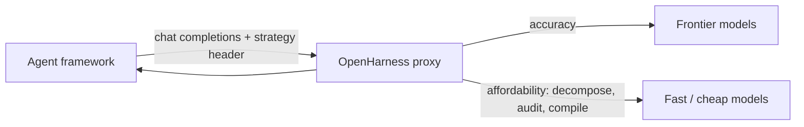

# OpenHarness (Decomphose)

[](LICENSE)

**OpenHarness** is an open-source Python middleware proxy (**Decomphose** — *Decomposition Harness*) that sits between autonomous agent frameworks and upstream LLM providers (OpenRouter, OpenAI-compatible APIs).

Instead of sending every large agent prompt to an expensive frontier model, clients choose a **strategy** via HTTP header and let the harness optimize cost, context use, and reliability.

**Repository:** [github.com/eman1369a/OpenHarness](https://github.com/eman1369a/OpenHarness)

---

## The idea

Autonomous agents often ship **one huge prompt** plus **large context dumps** to a single premium model. That works, but it is expensive, noisy, and brittle at scale.

OpenHarness treats the LLM layer as a **routing and orchestration problem**:

| Strategy | Header | Philosophy |
|----------|--------|------------|
| **Accuracy** | `X-Harness-Strategy: accuracy` | *Precision Router* — analyze prompt + context size, pick the highest-capability frontier model from a dynamic registry, forward once for first-attempt success. |
| **Affordability** | `X-Harness-Strategy: affordability` | *Orchestrated Decomposition Sandbox* — never send the “big ask” to a premium model directly; decompose → diet context per micro-task → goal-auditor retry loop → compile a single chat completion response. |



### Affordability pipeline (4 steps)

1. **Decomposition** — cheap model breaks the master task into linear micro-tasks (JSON, Pydantic-validated; one corrective retry on malformed output, then graceful fallback to a single master task), tagging each with a **complexity**: `routine | standard | complex`.
2. **Context dieting** — each micro-task receives only `[context:key]` slices it needs.
3. **Model routing + goal auditor loop** — each micro-task runs on the cheapest model in its complexity tier; the “auditor” model rejects weak outputs and each rejection **escalates one tier up** (worker retries with feedback, max 3).
4. **Compilation** — validated segments merge into one OpenAI-shaped `chat.completion`.

Micro-task failures are **isolated** — one bad step does not crash the proxy.

---

## Status

Early scaffolding (v0.1). Strategies are wired; upstream calls are fully async and `stream: true` is supported on both strategies. Remaining production hardening (observability, hot-reload registry) is planned.

---

## Quick start

**Requirements:** Python 3.11+ (tested on 3.13)

```bash
git clone https://github.com/eman1369a/OpenHarness.git
cd OpenHarness

python -m venv .venv
# Windows: .venv\Scripts\activate
# macOS/Linux: source .venv/bin/activate

pip install -e ".[dev]"

cp .env.example .env
# Edit .env — set OPENROUTER_API_KEY (never commit .env)

decomphose
```

**Mock test** (no API key):

```bash
# Windows PowerShell
$env:MOCK_AFFORDABILITY="1"; python test_agent.py

# macOS/Linux
MOCK_AFFORDABILITY=1 python test_agent.py
```

**Live test** (server running + key in `.env`):

```bash
python test_agent.py
```

Point your agent SDK at `http://localhost:3100/v1` and add header `X-Harness-Strategy: affordability` or `accuracy`.

### Docker

```bash
docker compose up --build          # harness on http://localhost:3100

docker compose --profile test up --abort-on-container-exit   # + one-shot agent simulation
docker compose --profile otel up                             # + Jaeger trace UI on http://localhost:16686
```

`.env` is loaded if present (required for live upstream calls). `config/` is volume-mounted, so registry edits hot-reload inside the container. For the `otel` profile, set in `.env`:

```text
HARNESS_OTEL_ENABLED=1
OTEL_EXPORTER_OTLP_ENDPOINT=http://jaeger:4318
```

---

## Configuration

| Variable | Default | Description |
|----------|---------|-------------|
| `OPENROUTER_API_KEY` | — | **Required** for live upstream calls |
| `OPENROUTER_BASE_URL` | `https://openrouter.ai/api/v1` | OpenRouter API base |
| `HARNESS_HOST` | `0.0.0.0` | Bind address |
| `HARNESS_PORT` | `3100` | Listen port |
| `HARNESS_DECOMP_MODEL` | `anthropic/claude-3.5-haiku` | Decomposition model |
| `HARNESS_WORKER_MODEL` | `deepseek/deepseek-chat` | Micro-task worker (fallback when routing is disabled) |
| `HARNESS_WORKER_MODELS_PATH` | `config/worker-models.json` | Tiered worker registry for per-task routing |
| `HARNESS_AUDITOR_MODEL` | `anthropic/claude-3.5-haiku` | Goal auditor |
| `HARNESS_MAX_AUDITOR_RETRIES` | `3` | Auditor retry budget |
| `HARNESS_FRONTIER_MODELS_PATH` | `config/frontier-models.json` | Custom frontier model registry path |
| `HARNESS_OTEL_ENABLED` | `false` | Enable OpenTelemetry tracing |
| `OTEL_EXPORTER_OTLP_ENDPOINT` | — | OTLP/HTTP collector endpoint (requires `decomphose[otel]`); console exporter if unset |

Frontier models for the accuracy strategy: `config/frontier-models.json`. The registry **hot-reloads** — edit the file while the proxy runs and the next request picks it up. An invalid edit never takes down the proxy: the last good config keeps being served (with a logged warning) until the file is fixed.

### Context markers

Embed documents in user messages:

```text
[context:domain-brief]
Your document here...

[context:constraints]
More context...
```

The affordability strategy slices these per micro-task. Without markers, the full thread is used as `full-thread`.

### Observability

Set `HARNESS_OTEL_ENABLED=1` to emit OpenTelemetry traces. Each request produces a span tree:

```
harness.request                  strategy, request id, client model, stream
├── affordability.decompose      decomp model, micro-task count
├── affordability.micro_task     task id/title, auditor retries, pass/reject events
│   └── upstream.complete        per LLM call: model, response size
└── ...
```

Accuracy requests record the selected frontier model and estimated tokens on the request span. Spans go to an OTLP/HTTP collector when `OTEL_EXPORTER_OTLP_ENDPOINT` is set (`pip install -e ".[otel]"`), otherwise to the console. Tracing off = zero overhead (no-op tracer).

### Per-micro-task model routing

Inspired by [Factory Router](https://factory.ai/news/factory-router): pick the right model for the right task, and escalate when the chosen model struggles.

- The decomposition step classifies every micro-task as `routine`, `standard`, or `complex`.
- `config/worker-models.json` defines tiered worker pools (hot-reloadable, like the frontier registry). Each task starts on the **cheapest model in its tier**.
- An auditor REJECT escalates the retry to the **next tier up** instead of re-asking the same model — “if the selected model struggles, move to a more capable model.”
- Inspect routing per response: `x-harness-router`, `x-harness-worker-models`, `x-harness-router-escalations` headers (and `router.escalate` span events in traces).

Delete or repoint the registry (`HARNESS_WORKER_MODELS_PATH`) to disable routing — everything falls back to the static `HARNESS_WORKER_MODEL`.

### Streaming

Set `"stream": true` in the request body (standard OpenAI shape):

- **Accuracy** — true SSE passthrough: upstream `chat.completion.chunk` events are relayed as they arrive.
- **Affordability** — the decompose → audit → compile pipeline runs to completion, then the compiled result is replayed as synthetic `chat.completion.chunk` SSE events, so streaming clients work unchanged.

```bash
# Streaming live test (server running + key in .env)
# Windows PowerShell
$env:STREAM="1"; $env:STRATEGY="accuracy"; python test_agent.py

# macOS/Linux
STREAM=1 STRATEGY=accuracy python test_agent.py
```

---

## Project layout

```
src/decomphose/
  server.py              # FastAPI — POST /v1/chat/completions
  strategies/
    accuracy.py          # Precision Router
    affordability.py     # Decomposition sandbox
  registry.py            # Hot-reloading model registries (frontier + worker tiers)
  router.py              # Complexity tier -> worker model + escalation path
  telemetry.py           # OpenTelemetry setup (opt-in, OTLP or console)
  clients/openrouter.py  # Async OpenRouter client (complete / forward_raw / stream_raw)
  middleware/harness.py
  utils/streaming.py     # SSE encoding (passthrough + synthetic chunk streams)
  utils/decomposition.py # Pydantic validation of decomposition output
config/frontier-models.json
tests/test_streaming.py  # No-network smoke tests (fake upstream client)
test_agent.py
```

Run the test suite:

```bash
pytest tests/
```

---

## Security

- **Never commit** `.env`, API keys, or credentials. Only `.env.example` belongs in git.
- Rotate any key that was ever pasted into chat, logs, or a screenshot.
- See [SECURITY.md](SECURITY.md) for reporting and pre-push checklist.

---

## Roadmap

- [x] Async OpenRouter client + streaming passthrough
- [x] Structured decomposition validation (Pydantic)
- [x] Pluggable model registry (hot reload)
- [x] OpenTelemetry traces per micro-task
- [x] Docker Compose for local agent testing

### v0.2

- [x] Per-micro-task model routing with tier escalation (Factory Router-style)
- [ ] Per-request cost accounting headers
- [ ] Parallel micro-task execution for independent tasks

---

## License

MIT — see [LICENSE](LICENSE).
